# Knowledge Discovery from Patient Drug Reviews Using CRISP-DM Text Mining

**Course:** XBDS2024N — Knowledge Discovery and Data Mining  
**Programme:** Bachelor of Computer Science (Hons)  
**Institution:** School of Computing and Creative Media, UOW Malaysia KDU  
**Semester:** June 2026  
**Assignment type:** Individual Assignment  

---

## Table of Contents

1. [Introduction](#1-introduction)
2. [Business Understanding](#2-business-understanding)
3. [Data Understanding](#3-data-understanding)
4. [Text Data Preparation](#4-text-data-preparation)
5. [Modeling](#5-modeling)
6. [Evaluation](#6-evaluation)
7. [Deployment (Suggested Application)](#7-deployment-suggested-application)
8. [Ethical Considerations](#8-ethical-considerations)
9. [Conclusion](#9-conclusion)
10. [Reproducibility and Project Artefacts](#10-reproducibility-and-project-artefacts)
11. [Assessment Rubric (Self-Mapping)](#11-assessment-rubric-self-mapping)
12. [References](#12-references)

---

## 1. Introduction

Knowledge discovery and data mining (KDDM) transform raw data into actionable insight. For unstructured text, this requires a disciplined process that links a business problem to preparation, modeling, evaluation, and deployment. This project applies the **CRISP-DM** methodology (Chapman et al., 2000) to a real-world **patient drug review** corpus from Druglib.com, published via the UCI Machine Learning Repository (Gräßer et al., 2018).

Two complementary text-mining tasks are addressed:

1. **Supervised classification (Model 1):** Predict perceived drug **effectiveness** from free-text `benefitsReview` using TF-IDF features with Logistic Regression and Linear SVM, comparing original **5-class** labels with a binned **3-class** scheme.
2. **Unsupervised topic modeling (Model 2):** Discover latent **side-effect themes** from `sideEffectsReview` using Latent Dirichlet Allocation (LDA), with topic count selected by coherence and topics labeled from top keywords.

Together, these models support a practical triage scenario: flag reviews that sound ineffective, and organise side-effect language into interpretable themes for analysts. All diagrams in this report are generated computationally (no hand-drawn figures), consistent with assignment requirements.

---

## 2. Business Understanding

### 2.1 Application domain

Online health communities and review platforms collect large volumes of patient narratives about medications. These narratives describe perceived benefits and adverse effects in natural language, alongside structured labels such as effectiveness and side-effect severity. Pharmacovigilance teams, medical information units, and platform product teams need scalable ways to turn this text into searchable, prioritised signals without reading every review manually.

### 2.2 Business problem statement

**Problem.** Manually reviewing thousands of drug reviews to assess effectiveness language and side-effect themes does not scale, is inconsistent across reviewers, and delays insight for patient-support and safety workflows.

**How text mining helps.**

- Classification models convert benefits text into effectiveness categories that can power triage queues.
- Topic models convert side-effect text into theme tags that support filters, dashboards, and first-pass clustering for human review.

This is a **decision-support** research problem, not a clinical diagnostic system.

### 2.3 Project objectives and expected outcomes

| Objective | Expected outcome |
|-----------|------------------|
| Define a clear KDDM problem on authentic patient text | Documented CRISP-DM narrative linked to Druglib reviews |
| Predict effectiveness from benefits text | Trained LR / Linear SVM models with metrics versus a majority baseline |
| Quantify label granularity trade-offs | Side-by-side 5-class vs 3-class accuracy, macro-F1, and confusion matrices |
| Discover side-effect themes | 5–8 LDA topics with human-readable labels and keyword charts |
| Propose deployment | Conceptual Insight Console architecture and workflow |

### 2.4 Stakeholders

| Stakeholder | Interest |
|-------------|----------|
| Patients / caregivers | Clearer summaries of peer experiences |
| Clinicians / pharmacists | Fast scan of benefit language and recurring adverse-effect themes (support only) |
| Pharmacovigilance / safety teams | Automated tagging of themes and low-effectiveness signals for prioritisation |
| Review platforms / product teams | Moderating, searching, and surfacing reviews by theme |
| Data science / analytics teams | Reproducible pipeline, model comparison, and monitoring hooks |

### 2.5 Why the problem matters

Effectiveness and side effects are central to how patients evaluate therapy. Structured ratings alone miss nuance such as “helped my pain but ruined my sleep.” Free text carries that nuance. Review volume grows faster than human capacity; automated first-pass analysis reduces backlog while keeping humans in the loop for high-concern cases.

### 2.6 Relevance of the selected dataset

The UCI Drug Review Dataset (Druglib.com) provides paired free-text fields (`benefitsReview`, `sideEffectsReview`) and categorical effectiveness labels—exactly the structure needed for supervised classification plus unsupervised topic discovery on related but distinct text streams. The corpus size (~4.1k total reviews) is manageable for academic experimentation while remaining large enough for meaningful EDA and model comparison.

### 2.7 Success criteria

- Model 1 beats a majority-class baseline on **macro-F1** (critical under imbalance).
- Coefficients / top terms provide interpretable evidence.
- The 3-class vs 5-class comparison quantifies granularity versus reliability.
- Model 2 yields a coherent topic set (k in 5–8) with plausible manual labels and sample reviews.

---

## 3. Data Understanding

### 3.1 Dataset source and description

| Item | Detail |
|------|--------|
| Name | Drug Review Dataset (Druglib.com) |
| Source | UCI Machine Learning Repository (Gräßer et al., 2018) |
| URL | https://archive.ics.uci.edu/dataset/461/drug+review+dataset+druglib+com |
| Format | Tab-separated values (TSV), pre-split train/test |
| Train size | 3,107 rows × 9 columns |
| Test size | 1,036 rows × 9 columns |
| License note | Non-commercial research use; raw files are not redistributed in this repository |

**Attributes**

| Attribute | Type | Role in this project |
|-----------|------|----------------------|
| `reviewID` | Identifier | Uniqueness / leakage checks |
| `urlDrugName` | Categorical | Context (EDA) |
| `condition` | Categorical / text | Context (EDA) |
| `rating` | Numeric (1–10) | Descriptive analysis |
| `effectiveness` | Ordinal categorical (5 levels) | **Model 1 target** |
| `sideEffects` | Ordinal categorical (5 levels) | EDA / cross-tabs |
| `benefitsReview` | Free text | **Model 1 input** |
| `sideEffectsReview` | Free text | **Model 2 input** |
| `commentsReview` | Free text | Exploratory only |

### 3.2 Data quality assessment

**Missing values (train):** `benefitsReview` 0.58%, `sideEffectsReview` 2.41%, `commentsReview` 0.39%, `condition` 0.03%.  
**Missing values (test):** similar small rates (benefits ~0.48%, side effects ~2.22%).

Additional checks:

- No duplicate rows in train; no overlapping `reviewID`s between train and test.
- Empty-string rates for the three text fields were zero in the raw load used for EDA (missingness appears as nulls rather than blank strings).

**Implication:** Rows missing the text or label required by each model are dropped during preparation rather than imputed with synthetic text.

### 3.3 Class distributions and imbalance

**Effectiveness (train)**

| Class | Count | % |
|-------|------:|--:|
| Highly Effective | 1,330 | 42.81 |
| Considerably Effective | 928 | 29.87 |
| Moderately Effective | 415 | 13.36 |
| Ineffective | 247 | 7.95 |
| Marginally Effective | 187 | 6.02 |

**Side-effect severity (train)**

| Class | Count | % |
|-------|------:|--:|
| Mild Side Effects | 1,019 | 32.80 |
| No Side Effects | 930 | 29.93 |
| Moderate Side Effects | 614 | 19.76 |
| Severe Side Effects | 369 | 11.88 |
| Extremely Severe Side Effects | 175 | 5.63 |

**Rating:** mean ≈ 7.01, median 8, skewed toward higher satisfaction (skewness ≈ −0.87).

**Challenge:** Strong majority toward Highly/Considerably Effective means accuracy alone is misleading; macro-averaged metrics and balanced class weights are required.

### 3.4 Text characteristics

Mean token-ish lengths (whitespace-based word counts on raw text) are moderate: benefits reviews average on the order of ~36 words, with long-tailed distributions (some very long narratives). Short reviews limit feature richness for both classification and topic modeling.

### 3.5 Exploratory visualisations

The following figures were produced in `01_data_understanding.ipynb` / `02_data_preparing.ipynb` and saved under `visuals/`:

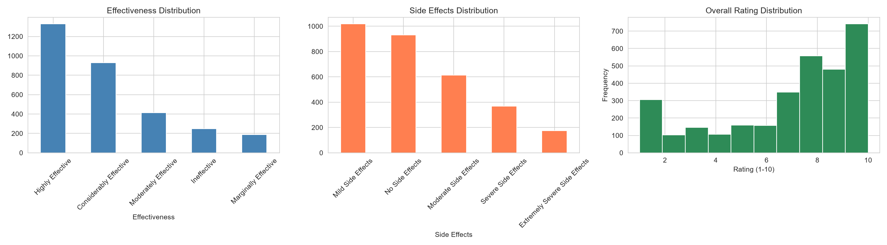

*Figure 1. Distributions of effectiveness, side-effect severity, and rating.*

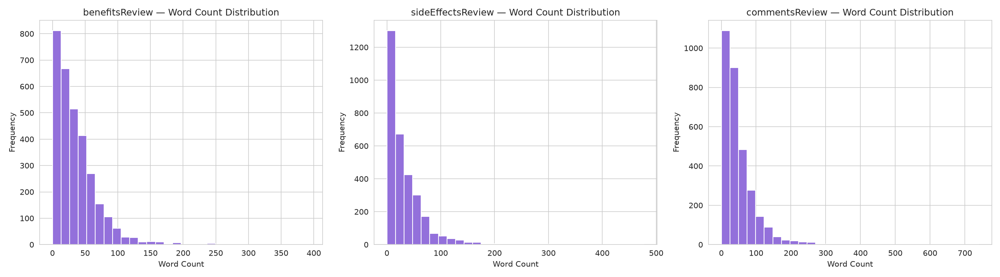

*Figure 2. Length distributions for benefits, side-effects, and comments text.*

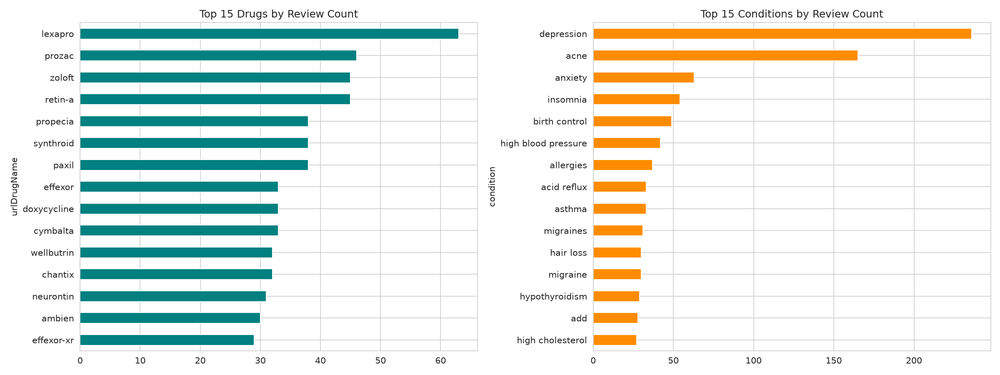

*Figure 3. Most frequent drugs and conditions in the training set.*


*Figure 4. Raw word clouds for benefits, side-effects, and comments reviews.*

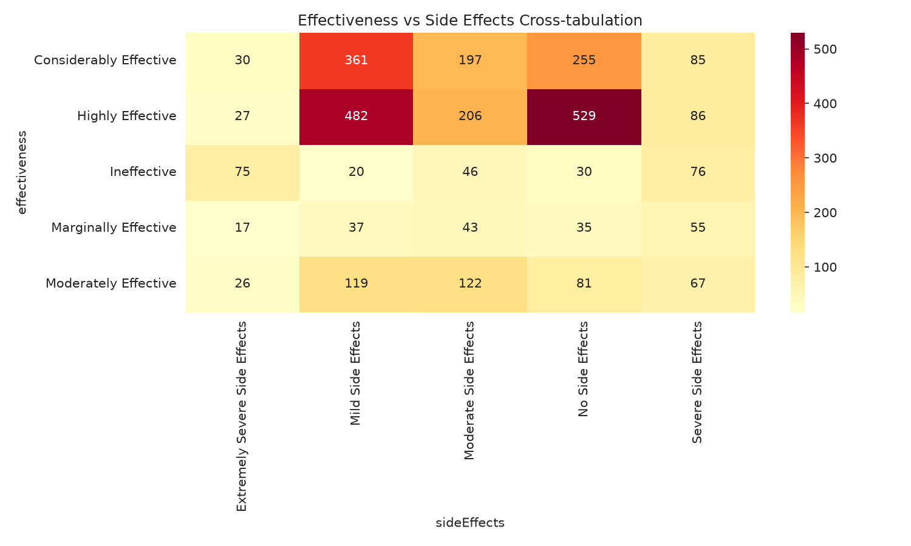

*Figure 5. Cross-tabulation heatmap of effectiveness versus side-effect severity.*

### 3.6 Key insights from EDA

1. **Imbalance dominates Model 1 risk** — without rebalancing / macro metrics, models can appear accurate while ignoring Ineffective / Marginally Effective reviews.
2. **Benefits and side-effect texts are related but not identical tasks** — justifying separate modeling streams rather than a single multi-task model for this assignment scope.
3. **Generic tokens** (“side”, “effect”, “drug”) are frequent; cleaning and vectorizer `min_df` / `max_df` settings matter for topic sharpness.
4. **No train/test ID leakage** was detected — supporting honest held-out evaluation using the UCI split.

---

## 4. Text Data Preparation

All preparation steps are implemented in `02_data_preparing.ipynb` and persisted to `data/processed/` for modeling notebooks.

### 4.1 Missing-value handling and task-specific subsets

- **Model 1:** drop rows missing `benefitsReview` or `effectiveness`.
- **Model 2:** drop rows missing `sideEffectsReview`.

This preserves as much signal as possible for each task without inventing text.

### 4.2 Cleaning pipeline

| Step | Technique | Justification |
|------|-----------|---------------|
| Case folding | Lowercase | Normalises orthographic variation |
| Noise removal | Keep letters/spaces only (`[^a-z\s]` → space) | Removes punctuation/digits that add sparsity without semantic value for bag-of-words models |
| Whitespace normalisation | Collapse repeated spaces | Stable token boundaries |
| Tokenisation | NLTK `word_tokenize` | Standard English token split |
| Stop-word removal | NLTK English stop list **minus negations** (`not`, `no`, `never`, …) | Negation is a strong effectiveness cue (“not help”, “no benefit”) |
| Lemmatisation | WordNet lemmatizer | Reduces inflectional sparsity better than crude stemming for interpretability |
| Empty-document filter | Drop rows empty after cleaning | Prevents zero vectors |

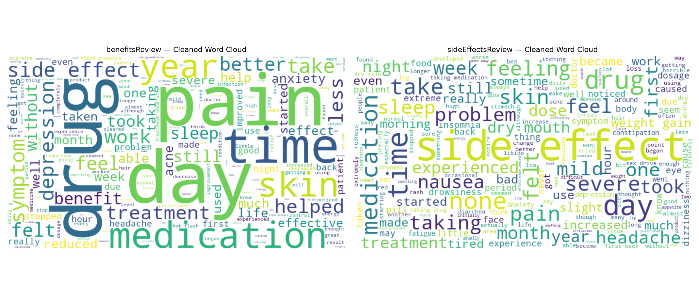

*Figure 6. Word clouds after cleaning (benefits vs side-effects).*

### 4.3 Feature extraction — Model 1 (TF-IDF)

```text
TfidfVectorizer(
  max_features=3000,
  ngram_range=(1, 2),   # unigrams + bigrams (e.g., "not benefit")
  min_df=3,
  max_df=0.9
)
```

- Fit on cleaned training benefits text; transform test with the same vocabulary.
- Remove all-zero TF-IDF rows (rare residual empties).
- Final shapes used in modeling: **train (3,085 × 3,000)**, **test (1,030 × 3,000)**.

**Why TF-IDF?** It down-weights corpus-wide common terms and emphasises discriminative phrases; it remains sparse and compatible with linear classifiers, supporting coefficient-level interpretation.

### 4.4 Class imbalance handling

Balanced class weights are computed for both schemes (`sklearn.utils.class_weight.compute_class_weight` / `class_weight='balanced'` in estimators). Minority classes (e.g., Marginally Effective, Ineffective; Low/Moderate in 3-class) receive higher weights so the optimiser does not ignore them.

### 4.5 3-class effectiveness mapping (comparison study)

| 3-class label | Source 5-class labels |
|---------------|------------------------|
| **High** | Highly Effective, Considerably Effective |
| **Moderate** | Moderately Effective |
| **Low** | Marginally Effective, Ineffective |

**Train counts after preparation:** High 2,254 · Moderate 414 · Low 417.  
**Test counts:** High 721 · Moderate 157 · Low 152.

Rationale: adjacent ordinal classes are hard to separate from short benefits text; binning tests whether coarser labels improve reliability for triage while remaining clinically meaningful.

### 4.6 Feature extraction — Model 2 (document–term matrix)

```text
CountVectorizer(
  max_features=2000,
  ngram_range=(1, 2),
  min_df=5,
  max_df=0.9
)
```

- Fit on cleaned training `sideEffectsReview`.
- Remove zero-count documents.
- Final DTM: **(3,019 × 2,000)** — suitable bag-of-words input for LDA.

**Why counts (not TF-IDF) for LDA?** Classical LDA assumes multinomial word counts; TF-IDF can distort generative assumptions (Blei et al., 2003).

### 4.7 Dataset splitting

The official UCI train/test split is retained (no random reshuffle of the provided partition). This supports reproducibility and matches the dataset authors’ evaluation design. Prepared matrices, labels (5-class and 3-class), vectorizers, and class-weight dictionaries are saved under `data/processed/`.

### 4.8 Impact of preparation decisions

- Negation-aware stops improve Model 1 signal for Low/Ineffective language.
- Bigrams capture multi-word cues (“side effect”, “weight gain”).
- Aggressive vocabulary caps (`max_features`) keep models tractable on sparse text.
- Separate pipelines avoid forcing one representation to serve classification and topic modeling poorly.

---

## 5. Modeling

At least two text-mining approaches are required; this project implements **supervised multiclass classification** and **unsupervised topic modeling**, with an additional within-Model-1 algorithm comparison (LR vs SVM) and label-scheme comparison (3 vs 5 class).

### 5.1 Model 1 — Effectiveness classification

**Notebook:** `03_model_1_modeling.ipynb`  
**Input:** TF-IDF benefits features  
**Targets:** 5-class `effectiveness` and mapped 3-class labels  
**Algorithms:**

| Algorithm | Configuration | Why selected |
|-----------|---------------|--------------|
| Logistic Regression | `class_weight='balanced'`, `max_iter=1000`, `random_state=42` | Strong sparse-text baseline; interpretable coefficients per class |
| Linear SVM (`LinearSVC`) | `class_weight='balanced'`, `max_iter=5000`, `random_state=42` | Often competitive on high-dimensional TF-IDF; max-margin separation |
| Majority baseline (`DummyClassifier`) | `strategy='most_frequent'` | Sanity floor for accuracy/macro-F1 claims |

**Training procedure:** Fit each estimator on the training TF-IDF matrix and evaluate on the held-out test matrix. Both label schemes share identical features so differences isolate the target definition.

**Interpretability:** For Logistic Regression, top positive coefficient terms per class are extracted (e.g., Ineffective/Low associated with “none”, “benefit”, “not”; Highly/High with stronger benefit language). This supports stakeholder trust beyond black-box scores.

### 5.2 Model 2 — Side-effect topic modeling (LDA)

**Notebook:** `04_model_2_topic_modeling.ipynb`  
**Input:** Count-based DTM of cleaned `sideEffectsReview`  
**Algorithm:** Gensim `LdaModel`

| Setting | Value | Justification |
|---------|-------|---------------|
| `num_topics` (k) | Swept **5–8** | Assignment-appropriate range; balances interpretability vs fragmentation |
| Selection criterion | Maximum **c_v coherence** | Quantitative proxy for topic quality (Röder et al., 2015) |
| `passes` / `iterations` | 10 / 100 | Stable enough for corpus size without excessive runtime |
| `random_state` | 42 | Reproducibility |
| `alpha` / `eta` | `auto` | Learn asymmetric priors from data |

**Selected model:** **k = 5** with c_v coherence ≈ **0.726** (best among 5–8).

**Manual topic labels (from top keywords):**

| Topic | Label | Example keywords | Dominant docs (train) |
|------:|-------|------------------|----------------------:|
| 0 | Onset / GI discomfort & sleep disruption | stomach, night, insomnia, dose | 489 |
| 1 | Minimal / generic side-effect language | side, effect, none, medication | 1,130 |
| 2 | Severe pain, nausea, headache & fatigue | pain, severe, nausea, dizziness, fatigue | 254 |
| 3 | Skin / acne treatment effects | skin, acne, week, month | 846 |
| 4 | Weight, dryness & sexual side effects | weight, dry, libido, sexual, mouth | 300 |

Documents are assigned a **dominant topic** for qualitative spot checks and deployment tagging.

### 5.3 How the two models address the problem statement

- Model 1 answers: “Does this benefits narrative sound High / Moderate / Low effectiveness?”
- Model 2 answers: “Which side-effect theme does this narrative most resemble?”
- Combined: a review card for triage dashboards (predicted effectiveness + topic tag), with human review for Low or severe themes.

---

## 6. Evaluation

Evaluation is consolidated in `05_evaluation.ipynb`, with detailed metrics produced in the modeling notebooks.

### 6.1 Metrics

For Model 1 (multiclass, imbalanced):

- Accuracy
- Macro Precision / Recall / **Macro F1** (primary fairness-oriented metric)
- Per-class classification report
- Confusion matrices

For Model 2:

- c_v coherence across k
- Qualitative inspection of keywords + sample reviews
- Dominant-topic volume distribution

ROC-AUC is less central here because the primary production framing is multiclass triage with ordinal-ish labels; macro-F1 and confusion structure are more informative for five- and three-way decisions.

### 6.2 Model 1 results (held-out test)

| Scheme | Model | Accuracy | Macro-P | Macro-R | Macro-F1 |
|--------|-------|---------:|--------:|--------:|---------:|
| 5-class | Majority baseline | 0.399 | 0.080 | 0.200 | 0.114 |
| 5-class | Logistic Regression | 0.472 | 0.420 | 0.440 | **0.429** |
| 5-class | Linear SVM | 0.455 | 0.395 | 0.401 | 0.397 |
| 3-class | Majority baseline | 0.700 | 0.233 | 0.333 | 0.275 |
| 3-class | Logistic Regression | 0.678 | 0.555 | 0.580 | **0.565** |
| 3-class | Linear SVM | 0.709 | 0.562 | 0.542 | 0.550 |

**Lift over baseline (macro-F1):** LR 5-class +0.315; SVM 5-class +0.283; LR 3-class +0.290; SVM 3-class +0.276.

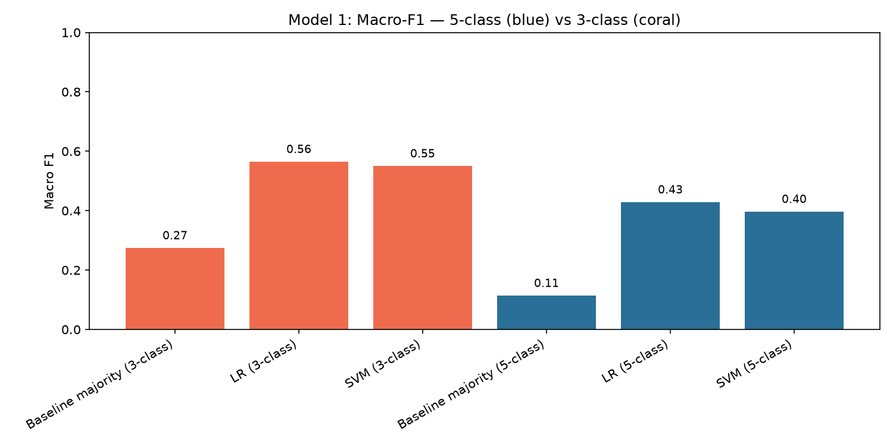

*Figure 7. Macro-F1 comparison across schemes and models.*

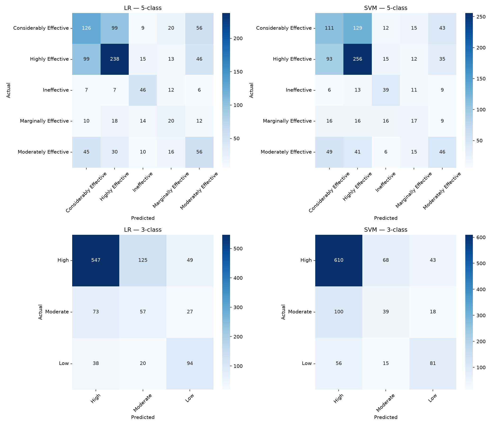

*Figure 8. Confusion matrices for LR/SVM under 5-class and 3-class targets.*

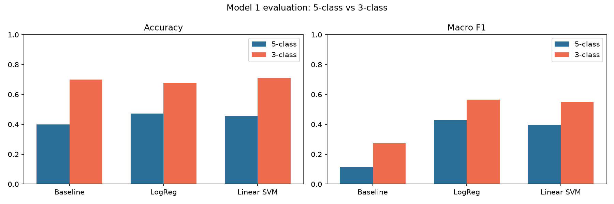

*Figure 9. Evaluation view of accuracy and macro-F1 by scheme.*

### 6.3 Interpretation — Model 1

**Strengths**

- Both LR and SVM clearly beat the majority baseline on macro-F1.
- Balanced weights improve minority-class attention relative to an unweighted majority-seeking fit.
- **3-class binning improves macro-F1** (~0.56 vs ~0.43 for LR) by collapsing adjacent, confusable ordinal tiers.
- LR remains preferable when coefficient explanations are needed.

**Limitations**

- Absolute 5-class accuracy remains modest (~47%) because classes are ordinal and overlapping in short text.
- Confusion concentrates between neighbouring classes (e.g., Highly vs Considerably).
- 3-class majority accuracy (~70%) looks strong but macro-F1 (~0.27) exposes the failure to predict Moderate/Low — reinforcing why macro-F1 is the right headline metric.
- Bag-of-words TF-IDF cannot model long-range discourse, sarcasm, or multi-condition narratives.
- Demographics, dose, and comorbidities are absent — residual confounding is likely.

**Recommendation:** Use **3-class Logistic Regression** for triage dashboards; retain **5-class LR** when fine labels are mandated, paired with confidence thresholds and human review.

### 6.4 Model 2 results

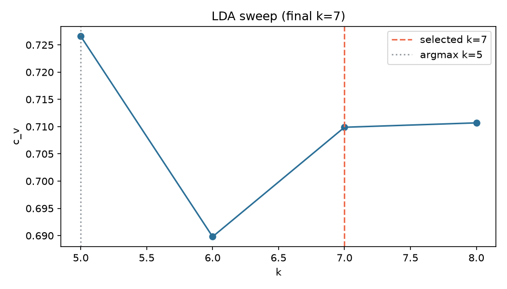

*Figure 10. LDA coherence sweep; k=5 selected.*

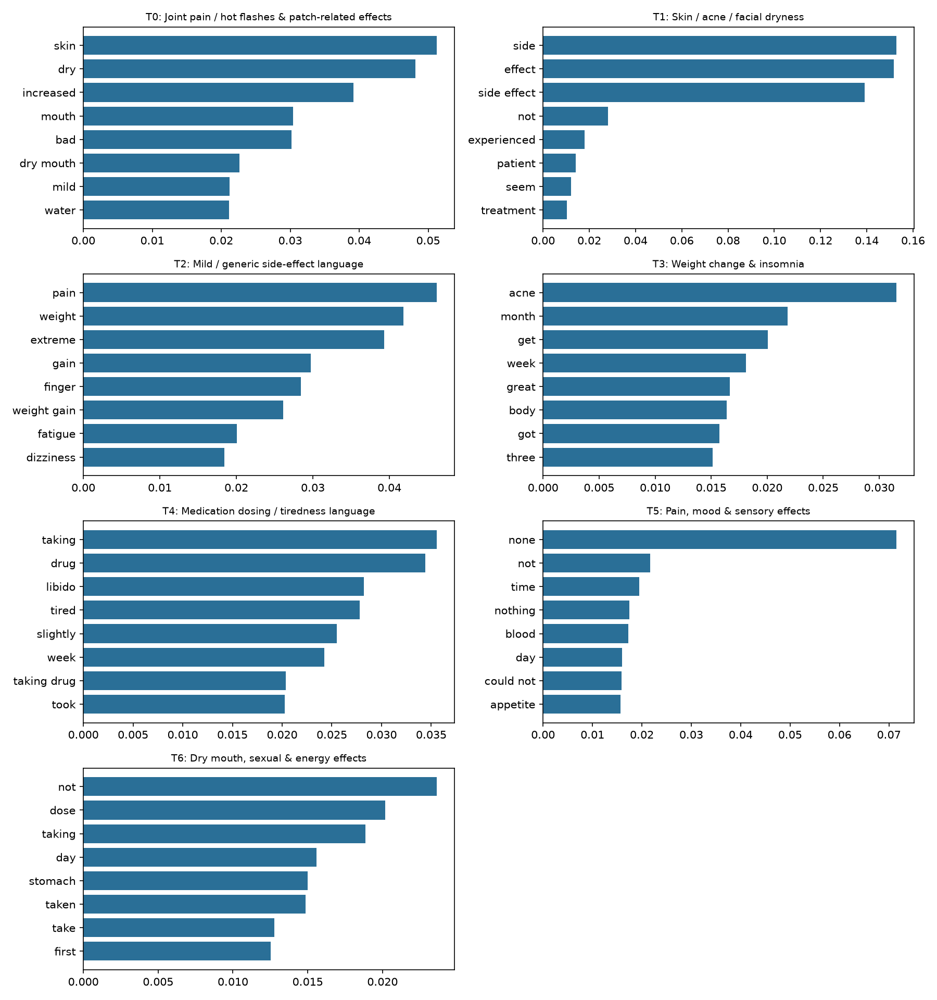

*Figure 11. Top keywords per labeled topic.*

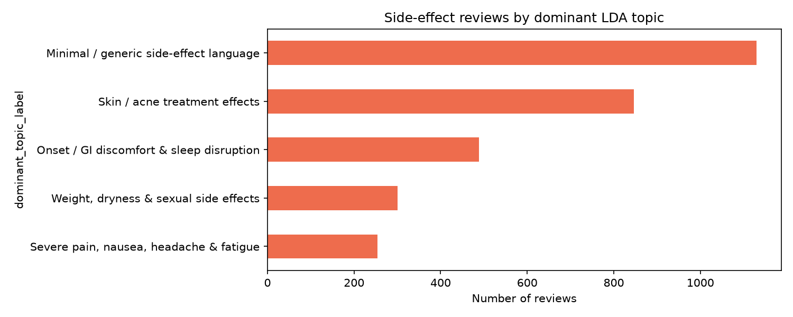

*Figure 12. Dominant-topic volumes.*

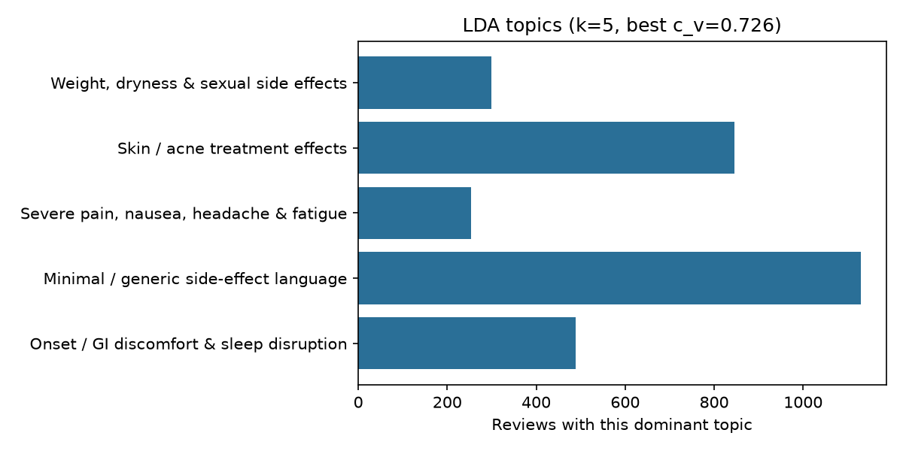

*Figure 13. Evaluation summary of topic volumes.*

**Strengths:** Coherence provides a transparent k choice; keywords support readable labels; dominant-topic tags enable dashboard facets without a hand-built ontology.

**Limitations:** Short reviews and generic “side effect” language inflate a minimal/generic topic; LDA can be seed-sensitive; topics do not encode severity by themselves; bag-of-words ignores negation scope and dosage context.

### 6.5 Joint business value

| Capability | Model | Business use |
|------------|-------|--------------|
| Predict perceived effectiveness | Model 1 | Flag Low-effectiveness reviews for support / QA |
| Choose label granularity | 3 vs 5 class | Triage (3) vs detailed analytics (5) |
| Surface side-effect themes | Model 2 | Theme filters and safety signal clustering |
| Combined review card | Both | Effectiveness prediction + topic tag for analysts |

---

## 7. Deployment (Suggested Application)

Deployment is conceptualised in `06_deployment.ipynb` as a **Drug Review Insight Console** for pharmacovigilance / medical information / moderation teams. It is a research prototype design, not a medical device.

### 7.1 Users and jobs-to-be-done

- **Inbox:** newest reviews with predicted 3-class effectiveness and dominant side-effect topic.
- **Theme explorer:** LDA topic volumes over time.
- **Review detail:** raw text, cleaned tokens, top contributing TF-IDF terms, topic mixture.
- **Human review queue:** Low effectiveness and/or high-concern topics requiring analyst sign-off.

### 7.2 Conceptual architecture

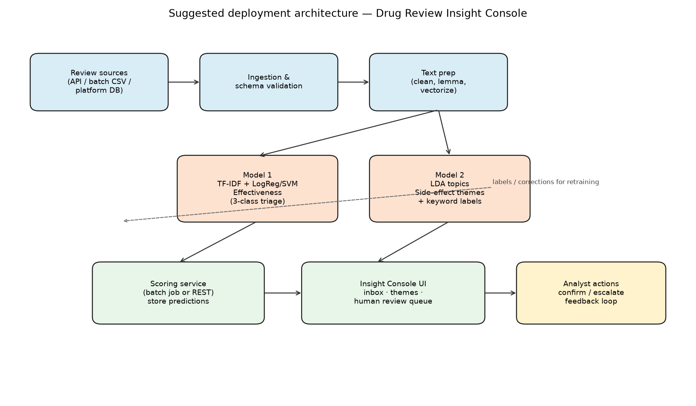

*Figure 14. Suggested deployment architecture (computationally generated).*

**Components:** review sources → ingestion/validation → shared text preparation → Model 1 scoring + Model 2 topic inference → scoring service / warehouse → Insight Console UI → analyst actions with feedback for retraining.

### 7.3 End-to-end workflow

1. Ingest `benefitsReview` and `sideEffectsReview` (plus drug/condition metadata).
2. Apply the same cleaning function and persisted vectorizers used in training.
3. Score Model 1 (primary: 3-class; optional: 5-class detail).
4. Infer LDA topic mixture; attach dominant topic label.
5. Route Low effectiveness or severe-topic hits to human review; otherwise archive/search index.
6. Monitor class priors, topic drift, and feedback labels; retrain on a schedule.

### 7.4 Integration options

| Mode | When to use |
|------|-------------|
| Nightly batch | Score exports; power BI dashboards |
| REST microservice | On-submit scoring for live queues |
| Analytics notebooks | Ad-hoc research (current repository pattern) |

### 7.5 Production caveats

- UCI Druglib terms restrict commercial redistribution/use; production systems need appropriately licensed corpora.
- UI must state that outputs are automated research signals, not medical advice.
- Free text may be sensitive; apply access control and careful logging.
- Prefer explainability artefacts (top contributing terms) beside predictions.

---

## 8. Ethical Considerations

Ethical handling is encouraged by the brief and is woven through this project:

1. **Non-clinical use disclaimer** — models support research triage only.
2. **Self-selection bias** — dissatisfied or highly motivated patients may over-represent extremes.
3. **Class imbalance / fairness of metrics** — macro-F1 and balanced weights reduce majority-class dominance.
4. **Missing demographics** — predictions may encode unobserved confounders (condition mix, drug mix).
5. **Human-in-the-loop** — severe themes and Low predictions require analyst confirmation before outbound action.
6. **Data licensing & privacy** — raw reviews are not republished; usage follows UCI non-commercial research terms.

---

## 9. Conclusion

This assignment applied the full CRISP-DM cycle to authentic patient drug-review text. Business understanding framed a triage problem for effectiveness language and side-effect themes. Data understanding exposed imbalance and text sparsity. Preparation built negation-aware cleaning, TF-IDF classification features, count-based topic features, and a 3-class label comparison. Modeling delivered Logistic Regression and Linear SVM classifiers plus an LDA topic model. Evaluation showed clear macro-F1 gains over majority baselines and a coherent five-topic side-effect structure, with 3-class LR recommended for triage. Deployment proposed an Insight Console architecture with human review gates. The solution is transparent, reproducible via ordered notebooks, and explicitly bounded by ethical constraints.

---

## 10. Reproducibility and Project Artefacts

| Artefact | Path |
|----------|------|
| Business Understanding | `notebooks/00_business_understanding.ipynb` |
| Data Understanding | `notebooks/01_data_understanding.ipynb` |
| Text Data Preparation | `notebooks/02_data_preparing.ipynb` |
| Model 1 | `notebooks/03_model_1_modeling.ipynb` |
| Model 2 | `notebooks/04_model_2_topic_modeling.ipynb` |
| Evaluation | `notebooks/05_evaluation.ipynb` |
| Deployment | `notebooks/06_deployment.ipynb` |
| Figures | `visuals/*.png` |
| Dependencies | `requirements.txt` |

**Run order:** place Druglib TSVs in `data/` → `pip install -r requirements.txt` → execute notebooks `00` through `06`.

---

## 11. Assessment Rubric (Self-Mapping)

Submission requirement: report **and** assessment rubric. The table below maps this documentation and the accompanying notebooks to the official XBDS2024N rubric bands (16–20 excellent → 0–7 missing). This is a self-assessment aid for marking alignment; final marks are determined by the lecturer.

| Criteria (weight) | Rubric focus (excellent band) | Evidence in this submission | Self-assessed band |
|-------------------|-------------------------------|-----------------------------|--------------------|
| **Business Understanding (10%)** | Clear problem, objectives, stakeholders, expected outcomes; strong domain justification | Section 2; notebook `00` | 16–20 |
| **Data Understanding (15%)** | Comprehensive description, EDA, visuals, quality assessment, insights | Section 3; notebook `01`; Figures 1–5 | 16–20 |
| **Text Data Preparation (20%)** | Thorough cleaning/tokenisation/features with justification | Section 4; notebook `02`; Figure 6 | 16–20 |
| **Modeling (25%)** | ≥2 appropriate models; clear implementation, parameters, justification | Section 5; notebooks `03`–`04` (LR, SVM, LDA + 3-vs-5 study) | 16–20 |
| **Evaluation (20%)** | Appropriate metrics, visuals, comparison, limitations | Section 6; notebook `05`; Figures 7–13 | 16–20 |
| **Deployment (10%)** | Realistic architecture, workflow, business application | Section 7; notebook `06`; Figure 14 | 16–20 |

**Communication / Presentation (separate 10% component):** not scored in this written document; the presentation should summarise Sections 2–7, demonstrate notebook/visual fluency, and answer questions on imbalance, 3-vs-5 trade-offs, and LDA labeling.

**Walkthrough attendance note (brief Requirement 1):** maximum mark is capped at 40% without walkthrough attendance — administrative, independent of report quality.

---

## 12. References

Blei, D. M., Ng, A. Y., & Jordan, M. I. (2003). Latent Dirichlet allocation. *Journal of Machine Learning Research, 3*, 993–1022.

Chapman, P., Clinton, J., Kerber, R., Khabaza, T., Reinartz, T., Shearer, C., & Wirth, R. (2000). *CRISP-DM 1.0: Step-by-step data mining guide*. SPSS Inc.

Gräßer, F., Kallweit, H., Kallweit, S., & Schneider, S. (2018). *Drug review dataset (Druglib.com)* [Data set]. UCI Machine Learning Repository. https://doi.org/10.24432/C5SK5S

Pedregosa, F., Varoquaux, G., Gramfort, A., Michel, V., Thirion, B., Grisel, O., … Duchesnay, É. (2011). Scikit-learn: Machine learning in Python. *Journal of Machine Learning Research, 12*, 2825–2830.

Řehůřek, R., & Sojka, P. (2010). Software framework for topic modelling with large corpora. In *Proceedings of the LREC 2010 Workshop on New Challenges for NLP Frameworks* (pp. 45–50).

Röder, M., Both, A., & Hinneburg, A. (2015). Exploring the space of topic coherence measures. In *Proceedings of the Eighth ACM International Conference on Web Search and Data Mining* (pp. 399–408). https://doi.org/10.1145/2684822.2685324

---

**Word count:** approximately 3,570 words (excluding reference list; body text including tables ≈ 3,650).  

*Formatting note for formal PDF export:* convert this Markdown to PDF using Times New Roman or Arial 11 pt, 1.15 line spacing, justified paragraphs, numbered pages, and APA citations as specified in the assignment caveat. All figures above are computer-generated (`visuals/`).
